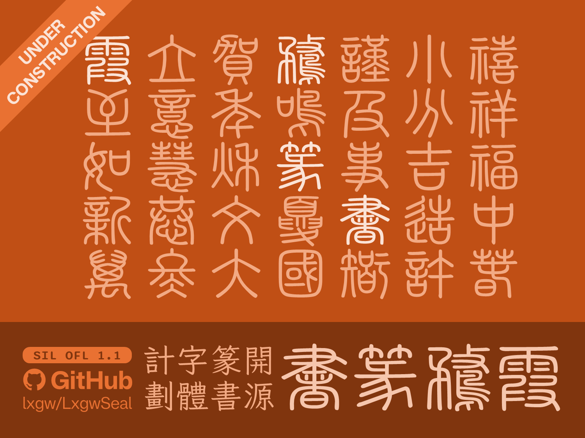
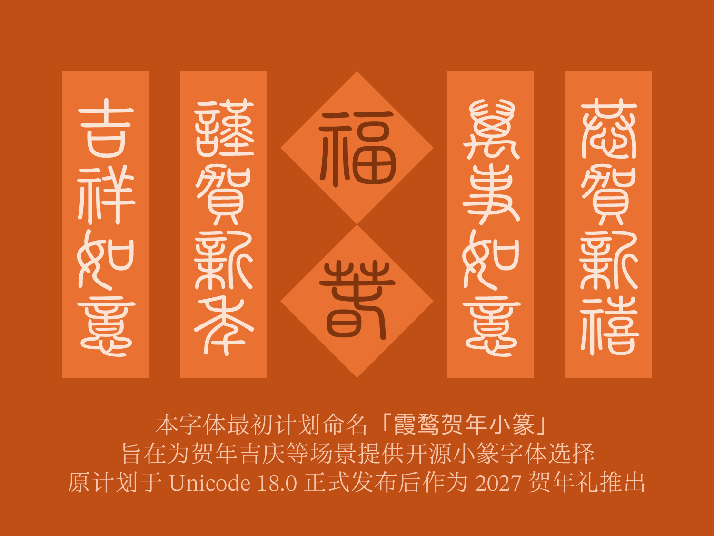
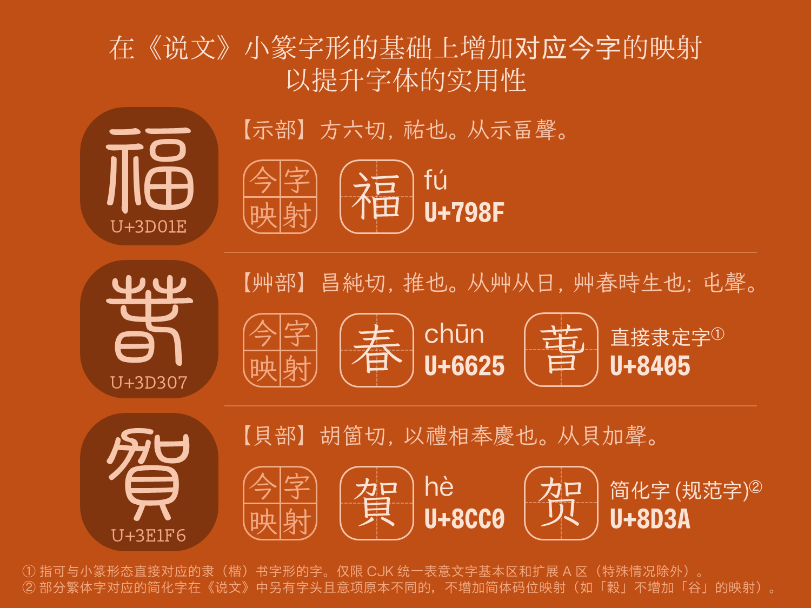
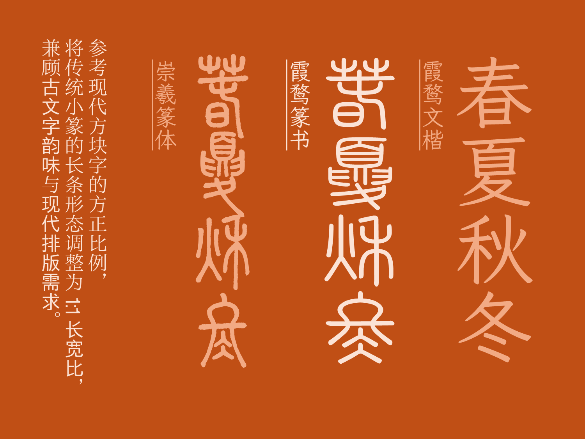
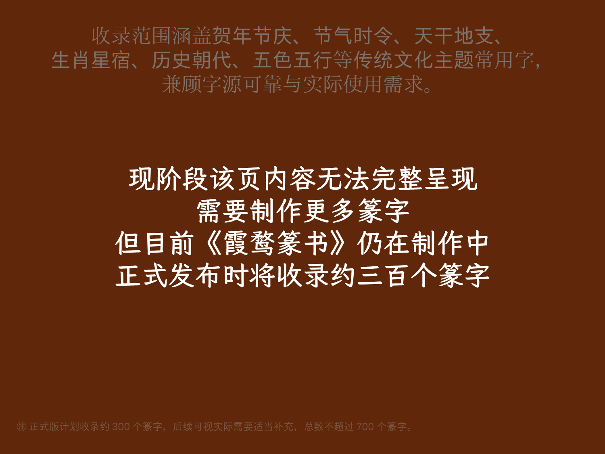
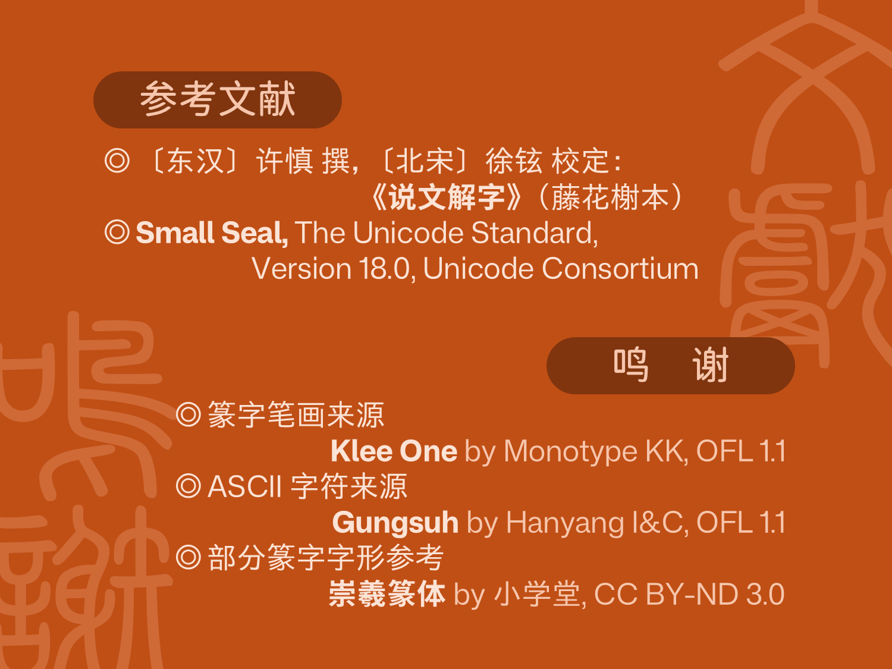

> UNDER CONSTRUCTION

# LXGW Seal / 霞鹜篆书
An open-source Small Seal Script (Xiaozhuan) font, compatible with Unicode 18.0 Small Seal characters. 一款开源的小篆字体，与 Unicode 18.0 小篆区块兼容。

## 字体简介

小篆是中国历史上首次官方文字统一的产物，由秦朝推行。东汉许慎编纂《说文解字》，系统收录了小篆字形，经多个版本流传至今。2026 年 9 月，[Unicode 18.0](https://www.unicode.org/versions/Unicode18.0.0/) 正式发布，首次将小篆纳入标准字符集，并对各个小篆字形的来源进行了系统整理。自此，篆字拥有了独立于 CJK 统一表意文字之外的编码体系。

考虑到篆书在节庆、历史等相关设计场景中的实用价值，《霞鹜篆书》项目应运而生。本字体从《说文解字》所收录的小篆字形中精选数百字，涵盖节庆祝福、生肖干支、节气时令、历史朝代等主题，兼顾字源可靠与实际使用需求。字体中的每个篆字均设有小篆区块码位，并包含对应今字的映射，便于在现代排版环境中直接使用。

### 收字原则
1. **字必有据**：所有收录字形均可在《说文解字》中找到明确的小篆依据。不收录《说文》未收的后起字，亦不根据楷书字形类推小篆写法。
2. **兼顾实用**：在保证字源可靠的前提下，优先收录节庆、时令、历史、生肖等传统文化场景中的常用字。
3. **映射处理**：部分后世常用字形（后起字）与《说文》本字差异较大（如「兖—沇」「谭—𨝸」，主要为部首不同），收录本字并建立与后世用字的映射，不在今字码位中放置类推小篆字形。
4. **简化字处理**：对于「谷/穀」「丰/豐」「离/離」等《说文》中本属不同字头、意义各异的简化合并字，仅收录正体/本字。若对应简化字本身亦有收录价值且其字形来源独立，则另行收录，不与本字共用同一字形。

### 字表及计划

> [!NOTE]
> 现阶段本字体仅包含篆字 45 字（[点击此处](./documentation/table.md)查看字表），后续将分批补充，请勿以当前字数评估项目完整性。

本字体计划主要按照以下范围收字：

- **节庆祝福**：福、禄、寿、喜、恭、贺、新、禧、吉、祥、安、康等；
- **时令节气**：春、夏、秋、冬、立、分、至、暑、寒、露、霜、降等；
- **历史朝代**：商、周、秦、汉、魏、晋、隋、唐、宋、元、明、清等；
- **二十八宿**：角、亢、氐、房、心、尾、箕等；
- **天干**：甲、乙、丙、丁、戊、己、庚、辛、壬、癸；
- **地支**：子、丑、寅、卯、辰、巳、午、未、申、酉、戌、亥；
- **生肖**：鼠、牛、虎、兔、龙、蛇、马、羊、猴、鸡、狗、猪；
- **五常**：仁、义、礼、智、信；
- **五方**：东、西、南、北、中；
- **五行**：金、木、水、火、土；
- **五色**：青、白、黄、赤、黑（玄）；
- **其他**：诗、词、歌、赋、比、兴、风、雅、颂、天、地、人等。

正式版发布将包含约 300 字，后续将视情况增补八卦、诸子百家、琴棋书画、地理（禹贡九州、舜十二州、当代中国各省份简称）、姓氏（以人口前 100 姓氏为主）等领域的常见字。

### 预览

## 获取字体
1. 进入 [Releases](http://github.com/lxgw/lxgwseal/releases) 界面获取最新字体更新；
2. 进入 [TTF](https://github.com/lxgw/lxgwseal/tree/main/TTF) 文件夹获取字体，或者进入 [FCP](https://github.com/lxgw/lxgwseal/tree/main/FCP) 文件夹获取该字体的工程文件（需要 FontCreator 15.0.0.3048 及以上版本）。

## 注意事项
- 本字体目前处于**早期制作阶段**，当前版本仅包含 45 字，后续将分批补充，请勿以当前字数评估项目完整性。正式版计划收录约 300 字，具体以实际发布版本为准。
- 本字体为个人兴趣项目，**非专业级字体产品**，字形风格以《说文》小篆为依归，适合海报广告设计、印章篆刻、文创设计等场景，不建议作为正文阅读字体长期使用。
- 本字体**暂无大幅扩充字数的计划**，仅作有限维护。如遇缺字或问题，欢迎通过 Issue 反馈，但不保证全部处理。

## 授权信息
本字体采用 [SIL Open Font License 1.1](https://openfontlicense.org) 授权许可。

> [猫啃网](https://www.maoken.com/)提供 SIL Open Font License 1.1 非官方[简体中文译本](https://www.maoken.com/ofl)便于理解，仅供参考。

### 许可

- 这款字体无论是个人还是企业都可以自由使用，包括商用，无需付费，也无需另行知会原作者。（但如果告知，我会很感激。🫶）
- 这款字体可以自由传播、分享，可安装于系统、嵌入软件或 APP 中，也可与任何软件捆绑再分发或一并销售。（再分发时需附带 [OFL.txt](./OFL.txt) 全文。）
- 这款字体可以自由修改、改造，制作衍生字体。修改或改造后的字体也必须同样遵守 [SIL Open Font License 1.1](https://openfontlicense.org/open-font-license-official-text/) 所规定的条款与条件。

### 限制

- 根据 OFL 1.1「许可与条件」中第 1 条的规定，**禁止单独出售字体文件**（OTF/TTF 格式文件）。
- 根据 OFL 1.1「许可与条件」中第 3 条的规定，在制作衍生字体时，未经作者明确的书面授权，字体名称不可使用原有字体的「保留名称」。本字体保留名称为：**霞鹜**（霞鶩）、**落霞孤鹜**（落霞孤鶩）、**LXGW**。基于本字体衍生的字体，未经作者（@lxgw）明确书面授权，名称不可出现上述字样。而在没有对字体源代码进行修改的情况下，重新编译的字体，可作为特例继续使用本字体保留名称；仅为网页端渲染优化（Web Font）之目的而对本字体进行子集化（Subsetting）或格式转换（如 WOFF/WOFF2），且不将其作为可安装的桌面字体文件提供给公众下载的情况下，同样适用该特例〔如 [Google Fonts](https://fonts.google.com) 等主流网页字体托管平台，或者 [ZSFT](https://fonts.zeoseven.com/) 等由作者（@lxgw）认可的第三方公益平台；其他平台如需适用此特例，请联系作者（@lxgw）确认〕。同时，根据第 4 条，未经作者（@lxgw）明确书面授权，本字体的任何衍生字体不得以作者（@lxgw）的名义推广、背书或宣传。
- 根据 OFL 1.1「许可与条件」中第 5 条的规定，该字体不可在 OFL 1.1 以外的授权许可下发行，亦不可将该字体与可能造成许可证冲突的其他协议字体（如 GNU GPL、IPA 等）混合至同一字体文件。

## 参考文献与鸣谢
### 参考文献
- 〔东汉〕许慎 撰，〔北宋〕徐铉 校定：《说文解字》（藤花榭本）
- *Small Seal*, The Unicode Standard, Version 18.0, Unicode Consortium

### 鸣谢
- **篆字笔画来源**：[Klee One](https://github.com/fontworks-fonts/Klee) by Monotype KK，OFL 1.1
- **ASCII 字符来源**：[Gungsuh](https://github.com/googlefonts/batang) by Hanyang I&C，OFL 1.1
- **部分篆字字形参考**：[崇羲篆体](https://xiaoxue.iis.sinica.edu.tw/chongxi/) by 小学堂，CC BY-ND 3.0（仅作风格参考，未直接取用字形数据）
- **部分参考资料来源**：[字统网](https://zi.tools)

## 相关项目
### Klee One 衍生字体项目
- [霞鹜文楷 / LXGW WenKai](https://github.com/lxgw/LxgwWenKai) | [Lite](https://github.com/lxgw/LxgwWenKai-Lite)
- [霞鹜文楷 GB / LXGW WenKai GB](https://github.com/lxgw/LxgwWenKaiGB) | [Lite](https://github.com/lxgw/LxgwWenKaiGB-Lite)
- [霞鹜文楷 TC / LXGW WenKai TC](https://github.com/lxgw/LxgwWenKaiTC)
- [霞鹜臻楷 / LXGW ZhenKai](https://github.com/lxgw/LxgwZhenKai)
### 更多开源字体
- [点击此处 / Click Here](https://github.com/lxgw/lxgw/blob/main/fonts.md)
